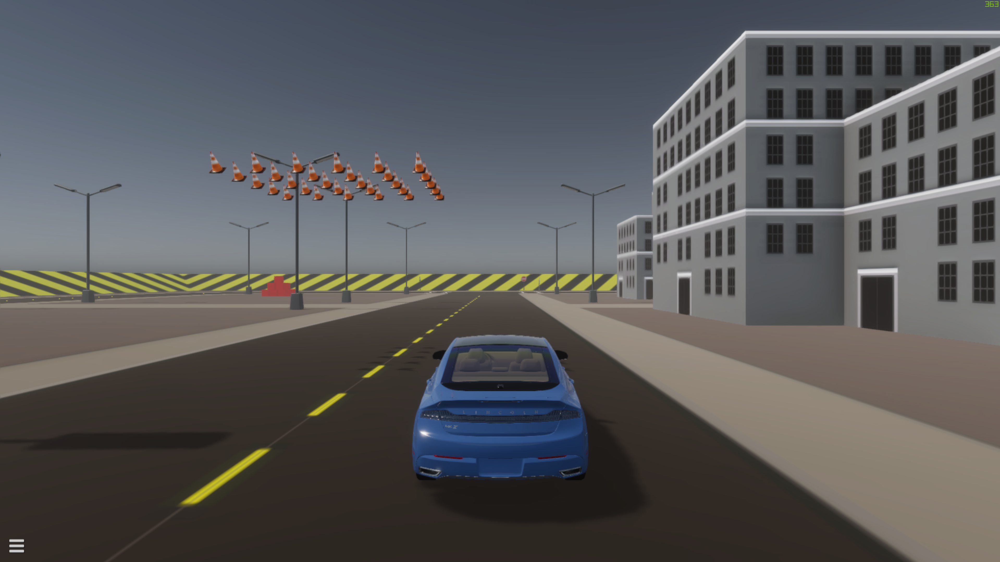

The 2020.01 release of SVL Simulator release is now [available](https://github.com/lgsvl/simulator/releases/tag/2020.01), and includes Controllable Plugins, camera lens distortion, and many more additions and improvements.

### Controllable Plugins

We have added support for custom Controllable objects to be added to the scene with the Python API. See the example [TrafficCone](https://github.com/lgsvl/TrafficCone) which is included in the Simulator binary and the accompanying [quickstart script](https://github.com/lgsvl/PythonAPI/blob/master/quickstart/28-control-traffic-cone.py)

### Camera Lens Distortion

In order to make camera images more realistic, you can now add distortion parameters to all camera sensors (Color Camera, Semantic Camera, Depth Camera). See the [Color Camera](https://www.lgsvlsimulator.com/docs/sensor-json-options/#color-camera) for an explanation on the parameters.

### Non-uniform Lidar Beam Distribution

To match real-world Lidar beam distributions, we have added support to specify the Elevation angle of each beam. See the [Lidar](https://www.lgsvlsimulator.com/docs/sensor-json-options/#lidar) for an example configuration of a non-uniform distribution.

### HD Map Lane Relations

We fixed our HD Map exporter to include the inter-lane relations. This fix allows Apollo to change lanes while driving and simplifies imported map annotations.

Get the latest features and fixes by downloading the [2020.01 Release](https://github.com/lgsvl/simulator/releases/tag/2020.01)!
