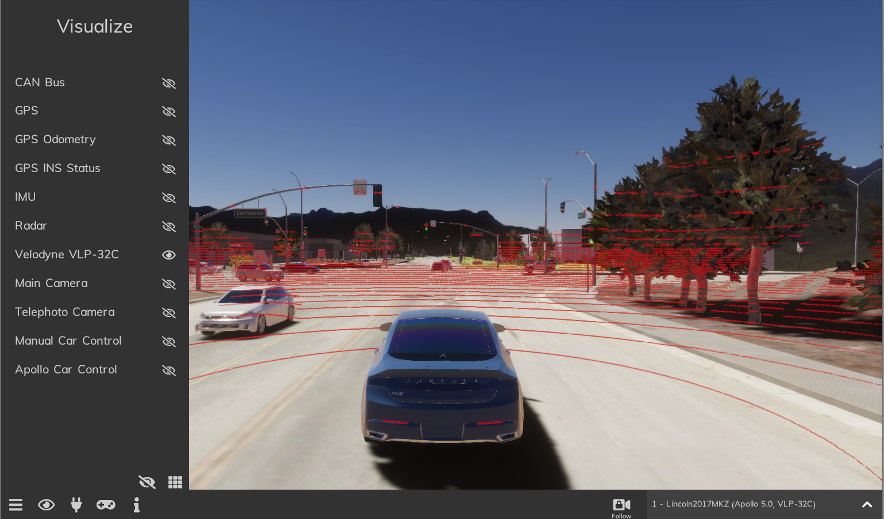

The 2020.03 release of SVL Simulator release is now [available](https://github.com/lgsvl/simulator/releases/tag/2020.03), and includes support for Velodyne LiDAR models, upgrade to the latest Unity 2019.3, and support for simulations using point-cloud-only environments.

### Support for Velodyne VLP-16 and VLP-32C LiDAR

We now support real-world [LiDAR sensor models](https://www.lgsvlsimulator.com/docs/lidar-plugin/) with more accurate specifications for the Velodyne VLP-16 and VLP-32C, including resolution and distribution of sensor beams. This is enabled by a custom LiDAR sensor plugin allowing LiDAR sensors to bypass the normal bridge communication interface and instead use a direct UDP connection to communicate with the target System Under Test (AD stack).

### Unity version upgrade

The 2020.03 release of SVL Simulator has been upgraded to Unity 2019.3.3. This Unity upgrade includes updates to HDRP and fixes several visual bugs. If you need to work with the source code of the simulator, please make sure to checkout the release-2020.03 branch, instead of master, on GitHub.

**Important** AssetBundle version changed with Unity upgrade. Please download the latest AssetBundles from the [content website](https://content.lgsvlsimulator.com/) and replace the URL of your maps and vehicles in the user interface.

### Support for Point-Cloud-only environments

Users can now import more lightweight environments into SVL Simulator (colorized point cloud environment). This enables users to run simulations with Digital Twin environments created from real world captured data. Please see a sample screenshot below of point-cloud-only environment support, and [contact us](https://www.lgsvlsimulator.com/contact/) if you have any additional inquiries.

You can view the full release notes for our 2020.03 release [here](https://github.com/lgsvl/simulator/releases/tag/2020.03).

Get the latest features and fixes by downloading the [2020.03 Release](https://github.com/lgsvl/simulator/releases/tag/2020.03). Please [contact us](https://www.lgsvlsimulator.com/contact/) for more information about SVL Simulator.
